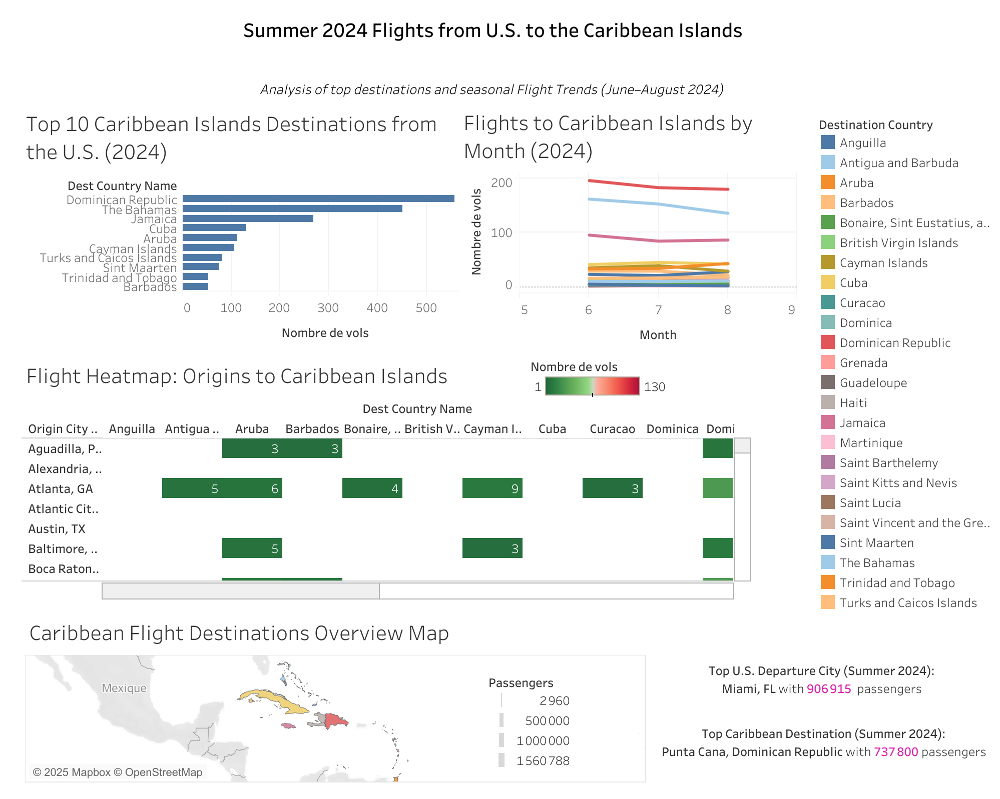

# Flights to Caribbean Islands - Summer 2024

## Project Overview  
End-to-end project showcasing data acquisition, cleaning, analysis, and 
visualization skills using real-world flight data. Focus is on U.S. flights 
to **Caribbean Islands** during summer 2024 (June–August).

The goal is to identify top destinations, seasonal trends, and 
overall passenger flows between the U.S. and these Caribbean destinations.

## Data Sources  
- Data extracted from [Bureau of Transportation Statistics (BTS) 
TranStats](https://www.transtats.bts.gov)  
- Dataset includes monthly passenger counts, origin/destination airports, 
carriers, and distances

## Dashboard Preview  
  
[View interactive dashboard on Tableau 
Public](https://public.tableau.com/views/flights_to_caribbean/Summer2024FlightsDashboard?:language=fr-FR&:sid=&:redirect=auth&:display_count=n&:origin=viz_share_link)

## Tools and Technologies  
- **Excel:** Initial data exploration and cleaning  
- **SQL:** Querying and aggregating large datasets from raw data  
- **Tableau:** Data visualization and dashboard creation

## Analysis  
- Filtered data for summer months (June–August 2024)  
- Calculated total passenger counts  
- Identified top Caribbean destinations from the U.S.  
- Highlighted leading U.S. departure cities  
- Visualized monthly passenger trends and heatmaps of flight origins

## Key Insights  
- Miami is the busiest departure city for flights to the Caribbean during 
summer 2024.  
- The Bahamas and Puerto Rico rank among the top 3 Caribbean destinations.  
- Passenger volumes peak in July, reflecting seasonal travel patterns.

## Dashboard  
An interactive Tableau dashboard showcasing KPIs and detailed visualizations is available here:  
👉 https://public.tableau.com/views/flights_to_caribbean/Summer2024FlightsDashboard?:language=fr-FR&:sid=&:redirect=auth&:display_count=n&:origin=viz_share_link

📁 The Tableau workbook (`.twbx`) can be found in the `/tableau/` folder.  
*Note: This project was created using Tableau Public Desktop.*


## How to Run / Reproduce the Analysis  
- The dataset and SQL scripts are included in this repository.  
- The Tableau workbook can be viewed locally or on Tableau Public via the link above.

## Project Structure

```
flights_to_caribbean/
├── data/              # Raw and cleaned datasets
├── sql/               # SQL scripts for data processing
├── tableau/           # Tableau dashboard file (.twbx)
├── images/            # Dashboard screenshot
└── README.md          # This file


